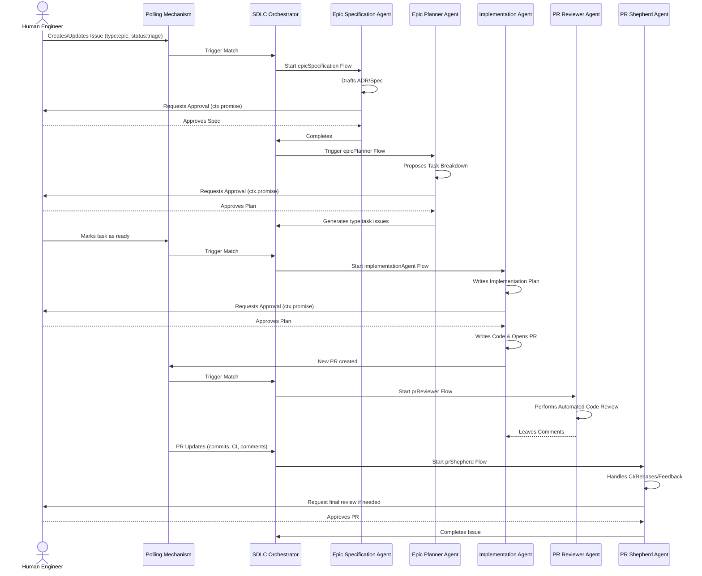

# 3. Comprehensive SDLC Workflows

Date: 2026-06-06

## Status

Accepted

## 1. Context & Problem

Currently, the agent has a single, monolithic workflow for issue implementation (`IssueWorkflowV1`). While functional for specific tickets, it lacks the ability to cover the full Software Development Life Cycle (SDLC) that an Agile engineering team requires. 

To be truly impactful, Son of Anton needs to operate beyond simple feature implementation and encompass:
- Researching and writing ADRs/Specs for Epics.
- Creating individual tickets to implement those ADRs/Specs.
- Picking up and implementing tickets in a structured sequence, opening PRs as needed.
- Performing an initial code review when PRs are opened.
- Monitoring PRs to handle rebases, CI failures, and addressing review comments.

This ADR designs the full SDLC flow orchestration, resolving the limitations of a monolithic approach by dividing responsibilities into specialized agents while ensuring clear "Human-in-the-Loop" checkpoints.

## 2. Flows, Triggers & Human-in-the-Loop

### State & Triggers
For the first iteration, the orchestration will rely on a dedicated Polling Mechanism instead of webhooks to drive the state machine. Son of Anton will periodically poll the issue tracker's API (e.g., GitHub Issues API) on a fixed interval (e.g., every 5 minutes). The poller will query for issues matching specific combinations of tracked labels. 
When a change is detected (e.g., a new issue is created with `type:epic` and `status:triage`, or an existing epic has its labels updated to match this state), the poller triggers the appropriate Restate workflow.
To prevent processing the same state change multiple times, the orchestration system relies on Restate's idempotency and deduplication by ID, ensuring the deduplication ID (derived from the issue ID and the specific state transition) is stored for at least 1 month. Standard labels to be used include:
- `type:epic`
- `type:task`
- `status:triage`
- `status:specifying`
- `status:planning`
- `status:implementing`

### Label Bootstrapping
Before interacting with a repository, Son of Anton must autonomously verify that these standard labels exist. If they do not, it will create them.

### Specialized Agent Flows
The system will be split into several distinct workflows:

1. **Epic Specification Flow (`epicSpecification`)**
   - **Trigger:** Detected via polling the issue tracker for issues with `type:epic` in a `status:triage` state.
   - **Behavior:** The agent researches the epic and drafts an ADR or Specification.
   - **Human-in-the-Loop:** A human engineer must review and approve the specification plan before it is finalized.

2. **Epic Planner Flow (`epicPlanner`)**
   - **Trigger:** Triggered after the Epic Specification is approved.
   - **Behavior:** The agent reads the generated ADR/Spec and proposes a list of task breakdowns.
   - **Human-in-the-Loop:** A human engineer must review and approve the task breakdown plan before the agent generates the individual `type:task` GitHub issues.

3. **Implementation Flow (`implementationAgent`)**
   - **Trigger:** Detected via polling the issue tracker for issues with `type:task` that are ready for work.
   - **Behavior:** The agent researches the codebase and writes an implementation plan. 
   - **Human-in-the-Loop:** A human engineer must approve the implementation plan before the agent writes the code and opens a Pull Request.

4. **Code Review Flow (`prReviewer`)**
   - **Trigger:** Detected via polling for newly opened PRs.
   - **Behavior:** Performs an initial automated code review pass, leaving comments on the PR for both the author and other reviewers.

5. **PR Shepherd Flow (`prShepherd`)**
   - **Trigger:** Detected via polling for PR updates, such as new commits, CI failures, or new review comments.
   - **Behavior:** Actively rebases the branch, attempts to fix CI failures, and addresses feedback iteratively until the PR is green and approved.

## 3. Technical Architecture

To implement this modular system, we will introduce new specialized Restate workflows:
- `epicSpecification`
- `epicPlanner`
- `implementationAgent`
- `prReviewer`
- `prShepherd`

For the flows requiring human intervention (`epicSpecification`, `epicPlanner`, and `implementationAgent`), we will standardize a planning/approval suspension loop. This will use Restate's `ctx.promise` to mimic the current `IssueWorkflowV1` behavior, effectively putting the workflow to sleep until a human provides approval via a GitHub comment or an API call.

## 4. Pros & Cons

### Pros
- **Granular Control:** Separating the monolithic workflow into specialized ones gives finer control over each stage of the SDLC.
- **Clear Human Touchpoints:** The Human-in-the-Loop design ensures that major decisions (specs, ticket creation, implementation plans) are vetted before making significant changes or spawning issues.
- **Modular Workflows:** Each workflow can be scaled, iterated upon, and maintained independently.

### Cons
- **Increased Orchestration Complexity:** Managing state across multiple distinct Restate workflows and GitHub events introduces more failure modes and coordination overhead.
- **Potential Bottlenecks:** Workflows that wait on human approval (via `ctx.promise`) will block progress on that specific epic/task if human reviewers are slow to respond.
