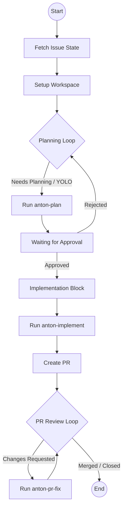

# Issue Resolution Workflow

This document describes the automated issue resolution workflow implemented in Son of Anton. The workflow leverages Restate for durable execution and Gemini for AI-driven planning and implementation.

## Workflow Overview

The workflow is designed to autonomously handle GitHub issues from initial report to Pull Request merge. It is divided into three main phases: Planning, Implementation, and PR Review.

### High-Level Flow

## Phases

### 1. Initialization
When a workflow is triggered (e.g., via a GitHub webhook), it fetches the current state of the issue and sets up a local workspace for Son of Anton to work in.

### 2. Planning Loop
In this phase, Son of Anton analyzes the issue and proposes a plan.
- **NEEDS_PLANNING**: The default state for new issues. Son of Anton uses the `anton-plan` skill to generate a step-by-step implementation plan.
- **WAITING**: Once a plan is proposed, the workflow waits for user feedback.
- **Approval**: A user approves the plan by approving the plan through the Son of Anton UI.
- **Rejection**: A user can request revisions by requesting revisions through the Son of Anton UI.

### 3. Implementation Block
Once a plan is approved, the state transitions to `NEEDS_IMPLEMENTATION`.
- Son of Anton uses the `anton-implement` skill to execute the approved plan.
- This involves making code changes, running tests, and finally creating a Pull Request.
- After the PR is created, the state transitions to `WAITING_PR_REVIEW`.

### 4. PR Review Loop
The workflow monitors the PR for reviews.
- **Changes Requested**: If a reviewer requests changes, the state transitions back to `NEEDS_IMPLEMENTATION` (or specifically handled by `anton-pr-fix`).
- **PR Fix**: Son of Anton uses the `anton-pr-fix` skill to address reviewer comments.
- **Completion**: The workflow finishes when the PR is either `MERGED` or `CLOSED`.

## State Transition Table

| Current State | Event | Next State | Description |
| --- | --- | --- | --- |
| `NEEDS_PLANNING` | Gemini proposes plan | `WAITING` | Plan is posted as a comment on the issue. |
| `WAITING` | User approves | `NEEDS_IMPLEMENTATION` | Workflow proceeds to implementation. |
| `WAITING` | User rejects | `NEEDS_PLANNING` | Workflow returns to planning to address feedback. |
| `NEEDS_IMPLEMENTATION` | Implementation starts | `NEEDS_IMPLEMENTATION` | Son of Anton is working on the code. |
| `NEEDS_IMPLEMENTATION` | PR created | `WAITING_PR_REVIEW` | Implementation finished, waiting for human review. |
| `WAITING_PR_REVIEW` | Reviewer requests changes | `NEEDS_IMPLEMENTATION` | Son of Anton will use `anton-pr-fix` to address comments. |
| `WAITING_PR_REVIEW` | PR merged | `MERGED` | Workflow completed successfully. |
| `WAITING_PR_REVIEW` | PR/Issue closed | `CLOSED` | Workflow terminated. |
| `YOLO` | Issue body contains `#yolo` | `NEEDS_IMPLEMENTATION` | (Implementation specific) Skip formal approval if requested. |

## Implementation Details

The workflow is implemented in `src/workflows/IssueWorkflowV1.ts`. It uses:
- **Restate**: To ensure durability and handle long-running waits (e.g., waiting for user approval).
- **Gemini CLI**: As the engine for AI tasks, utilizing specialized skills like `anton-plan`, `anton-implement`, and `anton-pr-fix`.
- **Custom Actions**: Located in `src/workflows/actions/`, these handle interactions with GitHub and the local file system.
